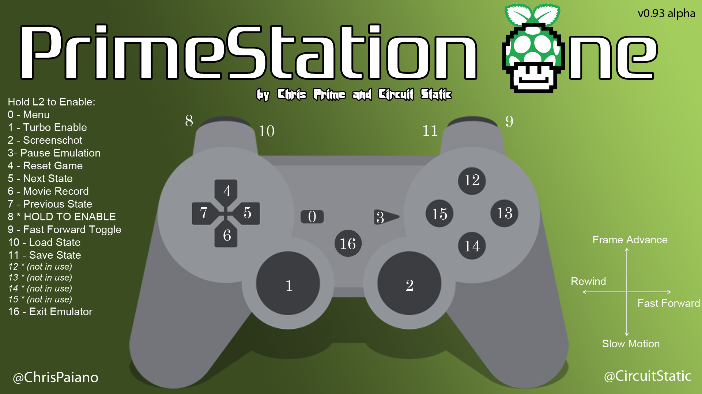

# PrimeStation One
## A Set of Scripts and Tools For a "Ready-To-Go" RetroPie with PS3 controls ready and configured to work with Bluetooth or USB on multiple games and game system emulations.
=============

### PS3 Controller Layout / Quick Reference: 

https://github.com/free5ty1e/primestationone/blob/master/splashscreen.png 

## BASIC USAGE
Install RetroPie (https://github.com/petrockblog/RetroPie-Setup) either via writing an SD card image downloaded from their site or building from sources (recommended, but this takes 24-36 hours!).  Once you can type 'emulationstation' from the command line and get into the basic EmulationStation interface and see one or two entries, you can continue with the PrimeStation One overlay scripts.

Clone the github repo for the primeStationOne to your Pi home folder and start the setup. (git pull is included in case you want to copy / paste the entire block below and paste into an SSH terminal window, to update if you've already cloned)
```
        cd ~
        git clone https://github.com/free5ty1e/primestationone.git
        cd primestationone
        git pull
        bin/primeStationOneSetup
```
    
Once this script completes, you should end up in the `RetroPie-Setup/retropie_setup.sh` menu, and you can just exit at this point if you'd like and restart (as your Pi may or may not have updated its firmware in the process as part of the self updating stuffs).  Note:  You can now type `restart` to restart the thing or `off` to turn off the thing.
    
At this point, there is a menu entry in the EmulationStation Settings menu page (script page) to `update_primestation_one.sh`, which you can also type in a command terminal.  It will perform a git pull to retrieve the latest verison of the setup script and supporting files, and run the bin/primeStationOneSetup again to ensure the latest things are thinged for your maximum thingness.
    
The `~/splashscreen.png` file can also be shown by typing `splashscreenQuickReference.sh`, or selecting this script from the Settings page in Emulationstation.  This also shows the layout of the PS3 controller for the auxiliary and management functions of RetroArch for most emulators (those with libretocores, of course).
    
So far mainly tested with the RetroPie image v2.3 downloaded from their site and written to SD card using a dd command.  Not sure if the very latest RetroPie built from sources will work correctly with these files, but we plan to test it soon!


## FUTURE
* Add the `opt/vc/src/hello_pi/*` demos to the Settings / Tools menu, or even a new Demos menu as these are neat to show off and why not?
* Quick reference image / controller layout / emulator notes for special emulators such as FastDosBox and RPix86 and the C64 emulator that shows via launchs script for X seconds before / while the actual emulator is loading up, so the user knows what might be useful to try on a controller from a couch...
* Menu system to handle running services, both for the current session and for all future sessions (services enabled / disabled upon startup).  The PrimeStation One can do a lot, and sometimes its nice to turn some unused features off!
* Update graphics for logos and theme backdrops for each menu item

Comments / suggestions / contributions to the code welcome!  

Credits: 
Chris "Prime" Paiano (Founder, Lead Developer) - Twitter: @ChrisPaiano
"Circuit Static" (User Experience, Quality, Development & Marketing) - Twitter: @CircuitStatic
